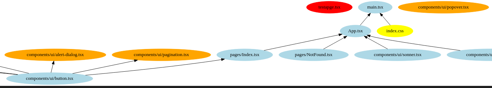

# Zombie File Hunter - GitHub Repository Analyzer for Lovable Projects


### TL;DR
- this project finds unsued files in a lovable repository
- Purpose; keep the codebase clean and minimalistic

## Story

When I used Loveable, I found it generated code and functions that I sometimes didn't want. When I deleted larger components or pages with multiple subcomponents, I discovered that some of the related files remained unused in the repository. I wanted to clean up the codebase and remove these unused files.

## How this works
This MCP allows you to interact with knowledge graphs available in your CodeGPT account or with public graphs from DeepGraph.

To create a graph from any GitHub repository, simply change the URL from github.com to deepgraph.co. For example:

GitHub repo: https://github.com/username/repo
DeepGraph URL: https://deepgraph.co/username/repo


#### This is the page we will use for our sample:


**Link to code:** [https://github.com/MorrisSimons/sample\_test\_page](https://github.com/MorrisSimons/sample_test_page)


#### We only want to look at a small portion of the image; which covers five points to help understand different parts of the project:


* Unused files are marked in red.
* Unused files part of the UI folder are marked in orange.
* Used files are marked in blue.

* Yellow files are non-code files like images, CSS, etc. (a debug functionality)
* Green files are used to find all the subcomponents of a file (a debug functionality) 

**Important notes about the code:**
* Files in the UI folder are typically generated uniformly for all projects but aren't always utilized. This explains why the sample repository has many unused files.
* Some files might be connected indirectly (e.g., to `button.tsx`) but remain unused by the `main.tsx` so it's not used in the project. All `.js`, `.jsx`, `.ts`, `.tsx` files not directly connected to the main project are marked red.

The primary purpose of this project is not just cleaning up the UI folder but identifying unused or forgotten files, such as leftover subcomponents like `testapge.tsx`. If you're interested, you can explore a larger example project in the `assets` folder of this repository.

## Example Outputs

This repository includes several example outputs in the `example_folder/`:
- **Real Estate Mapstore**: [`assets/import_graph_realestate-mapstore.svg`](assets/import_graph_realestate-mapstore.svg) - Analysis of a larger, more complex project
- **Sample Test Page Analysis**: [`import_graph_sample_test_page.svg`](import_graph_sample_test_page.svg) - Analysis of the sample repository mentioned above
Each analysis generates both `.dot` (source) and `.svg` (visual) files that show the dependency relationships between files in your project.

### Aim of this Project:

I want to identify and suggest removing unused files to maintain a clean, minimalistic, and readable codebase for lovable projects.

## Installation

1. **Install dependencies:**

```bash
pip install -r requirements.txt
```

### Public Repositories

```bash
python main.py "https://github.com/MorrisSimons/sample_test_page"
```

**Or just run the program and provide the URL when prompted:**

```
'https://github.com/MorrisSimons/sample_test_page'
```

### Private Repositories

For private repositories, set your GitHub token:

```bash
export GITHUB_TOKEN=your_github_token_here
python main.py owner/private-repo
```

### Complete Example

Here's a full example, including activating a virtual environment, setting the GitHub token, and analyzing a repository with target file highlighting:

```bash
export GITHUB_TOKEN=GH_token && python main.py "https://github.com/MorrisSimons/realestate-mapstore" myCompanies.tsx
```

This command will:
- Download and analyze the repository
- Highlight all files connected to `myCompanies.tsx` in green
- Mark non-code files (images, PDFs, CSS) in yellow
- Show unused files in red
- Generate both `.dot` and `.svg` visualization files

**Sample Output:**
```
Found 102 code files and 8 other files (110 total)
Graph: 110 nodes, 160 edges
Connected components: 73
Unused components: 37
```

## Output

The tool provides:

* **Console Output:** Summary report, including count of unused files and file type breakdown.
* **DOT File:** Dependency graph in DOT format (`import_graph_<repo>.dot`).
* **SVG File:** Visual graph with color-coded nodes (requires Graphviz):

### Color Coding System
* 🔵 **Light Blue:** Used/connected code files
* 🟢 **Light Green:** Files connected to the target file (when specified, e.g., `myCompanies.tsx`) "used to find a page and it's subcomponents/debugging"
* 🟡 **Yellow:** Non-code files (assets, documents, CSS, etc.)
* 🟠 **Orange:** unused UI component files (`components/ui/`)
* 🔴 **Red:** Unused "zombie" files

### Usage with Target File

To highlight files connected to a specific component:

```bash
python main.py "https://github.com/owner/repo" Pages/MyCompanies.tsx
```

This will mark all files that are dependencies of `myCompanies.tsx` in light green, making it easy to see which files are specifically related to that component.

## TODO:
- [x] Fix the README to explain the new updates.
- [x] Add yellow color for non-code files (assets, PDFs, etc.)
- [x] Add target file highlighting with green color.
- [x] Fix arguments input repo error handling.
- [ ] Fix Blob cache work, right now it caches the image and generates a new one.
- [ ] Build a dashboard to see how many unused lovable files exist.
- [ ] Minor grammar fixes and file renaming
- [ ] Test different scenarios where unused files are created and why.
- [ ] Improve detection of files imported in headers but not used in the project
- [ ] Add delete function for unused files
- [ ] Build it as an API
- [ ] Build it in Go
- [ ] Build it as a Docker container 
